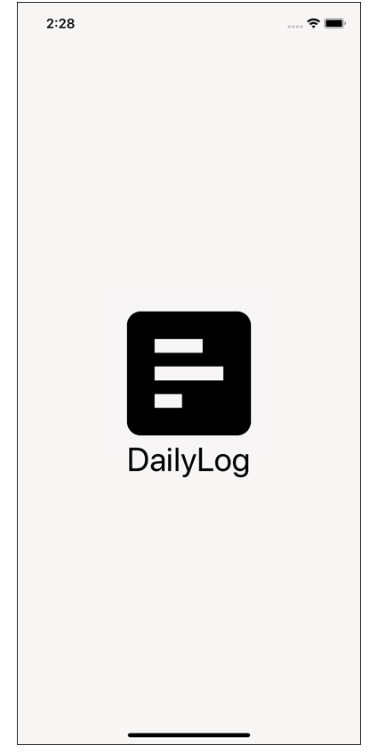
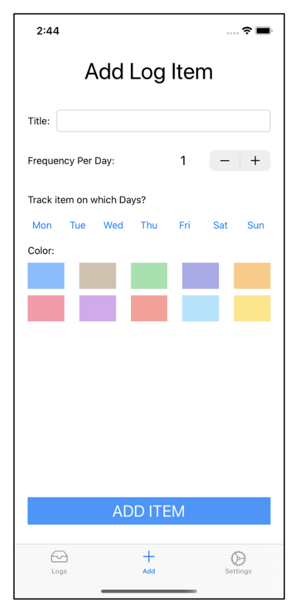
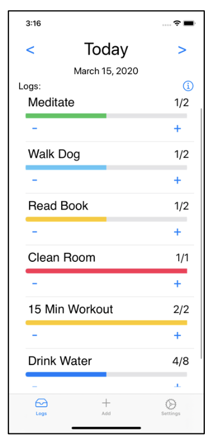
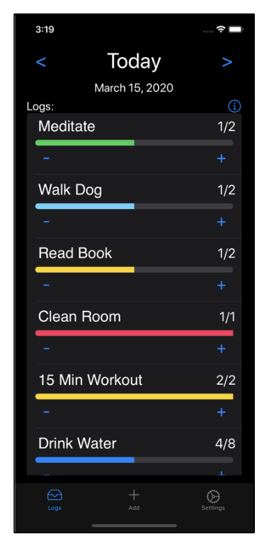
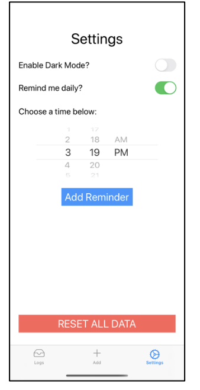
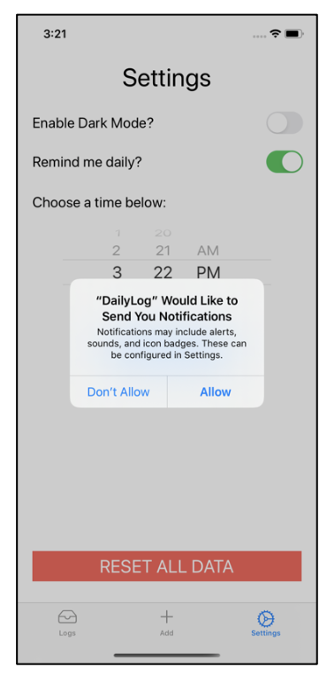
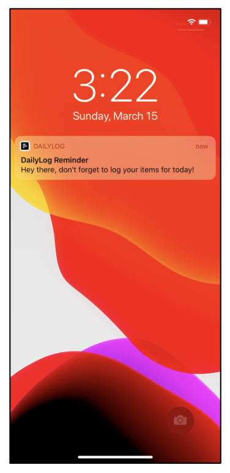

# DailyLog - Logging app for tasks
### Technologies Used: Swift, Xcode 

App allows a user to log and keep track of their daily tasks.
The app supports push Notifications as well.

### Screenshots
##### Launch Screen:   

##### Add Item Screen:  

##### Home Page:   

##### Dark Mode Home Page:   

##### Settings Screen:   

##### Push Notifications Permission Screen:   

##### Push Notification on Lock Screen:   

